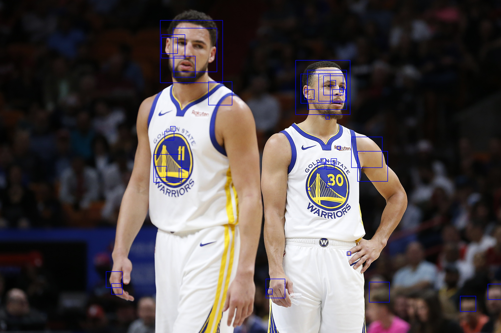

# MTCNN_tf2.0

### Dataset

WiderFace : http://shuoyang1213.me/WIDERFACE/

FaceLandmarks : http://mmlab.ie.cuhk.edu.hk/archive/CNN_FacePoint.htm

First : download解壓縮放在data file裡

And Then : 用preprocessing裡的code去做pnet、rnet、onet的training data

### PNet Output Result

